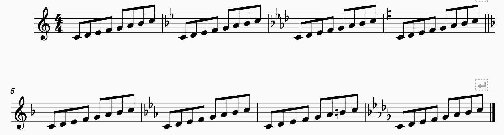
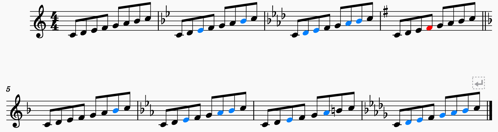
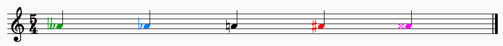

# altercolor
### Musescore plugin: colors notes with altered pitches
`Altercolor` makes note-reading a little easier by coloring sharped and flatted notes.  Consider the following examples of modal scales (Ionian, Dorian, ... ).



Coloring the flats blue and the sharps red shows which notes are altered in what way.


`AlterColor` also handles double sharps and double flats.



## Installation
### MuseScore 3.x
*Use release v1.0 of this repo, only.*
The plugin code is in a single file, `altercolor.qml`. Copy it to your Musescore Plugins directory and enable it with `ManagePlugins` from the Plugins menu.

### MuseScore 4.x
*Use release >= v2.0 of this repo.* Install the `altercolor` folder in your MuseScore Plugins directory and enable it with `ManagePlugins` from the Plugins menu. 

## Usage
AlterColor is derived from the `ColorNotes` plugin that ships with Musescore and works in the same manner, i.e., invoking it toggles the coloration on and off.


## Color scheme
The color scheme is arbitrary. I chose blue for flats and red for sharps to minimize problems for folks with red-green color blindness (by far the most common type). I did use green for double flats since it's extremely rare to see double flats and sharps or double sharps together within a single measure (and the double alterations are always accompanied by their respective symbols).

If you want to change the color scheme, it's defined near the top of `altercolor.qml`.

```qml
property string natural     : "#000000" // black
property string doublesharp : "#ff00ff" // hot pink
property string sharp       : "#ff0000" // red
property string flat        : "#0080ff" // blue
property string doubleflat  : "#00a000" // green
```

